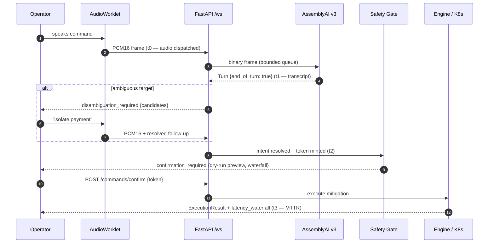

# VoiceOps Controller

**Voice-driven infrastructure incident mitigation, gated by explicit operator confirmation.**

[](https://www.python.org)
[](https://fastapi.tiangolo.com)
[](https://www.assemblyai.com)
[](https://groq.com)
[](https://www.docker.com)
[](tests/)
[](LICENSE)

---

## The Problem

It is 03:00. PagerDuty fires: `payment-gateway` is bleeding memory, 5xx error rate is climbing
through 40%, and the on-call engineer is away from a terminal — phone in hand, standing in a
hotel hallway.

Opening a laptop, VPN-ing in, and typing `kubectl top pods` costs four to six minutes of
compounding MTTR. Speaking takes seconds:

> **"Show top memory."** — pods render on the HUD.
> **"Kill the failing pod."** — two pods are degraded; the engine refuses to guess, names both
> candidates, and asks which one.
> **"Isolate payment."** — dry-run preview, cryptographic confirmation, mitigation executed.
> **"Rollback."** — the last action is reverted from a LIFO stack. Post-mortem already written.

VoiceOps collapses the observe → diagnose → mitigate loop into a sub-second voice channel —
**without ever letting speech alone mutate infrastructure.**

---

## System Flow

```
                       VOICEOPS CONTROLLER — MITIGATION PIPELINE
 ┌──────────────────────────────────────────────────────────────────────────────────┐
 │                                                                                  │
 │   BROWSER HUD                    FASTAPI CORE                  EXTERNAL          │
 │                                                                                  │
 │  ┌─────────────┐   PCM16 LE    ┌───────────────┐  ┌─────────┐  ┌───────────────┐  │
 │  │ AudioWorklet│─── 3200 B ───▶│ /ws/voice-    │─▶│ back-   │─▶│ AssemblyAI    │  │
 │  │ 16 kHz mono │    100 ms     │ stream        │  │pressure │  │ Streaming v3  │  │
 │  │ low-pass    │◀── transcript │ bounded queue │◀─│ queue   │◀─│ keyterms+PII  │  │
 │  └─────────────┘               └───────┬───────┘  └─────────┘  └───────────────┘  │
 │        ▲ waveform                      │ final Turn                              │
 │        │ canvas                        ▼                                         │
 │  ┌─────┴───────┐               ┌───────────────┐     ambiguous     ┌───────────┐  │
 │  │ speechSynt- │◀── candidates │ Deterministic │◀── degraded >1 ──│ Pod scan  │  │
 │  │ hesis 5-lang│               │ Intent Engine │                  │ anomaly / │  │
 │  └─────────────┘               │ regex+slot    │                  │ mem ≥75%  │  │
 │                                └───────┬───────┘                  └───────────┘  │
 │  ┌─────────────┐   confirm token       │ mutating intent (t2)                     │
 │  │  Operator   │◀── dry-run preview ───┤                                          │
 │  │  modal gate │                       ▼                                          │
 │  └──────┬──────┘               ┌───────────────┐     ┌───────────────────────┐     │
 │         │ POST /confirm        │ Incident Log  │     │ LIFO mitigation stack │     │
 │         └─────────────────────▶│  + waterfall  │────▶│ push → rollback_last  │     │
 │                                └───────┬───────┘     └───────────────────────┘     │
 │                                        │ execute (t3)                              │
 │                                        ▼                                          │
 │  ┌─────────────┐               ┌───────────────┐                                   │
 │  │ telemetry   │◀── waterfall──│ psutil host / │                                   │
 │  │ /ws stream  │               │ K8s sandbox   │                                   │
 │  └─────────────┘               └───────────────┘                                   │
 │                                        │                                          │
 │                                        ▼                                          │
 │                              ┌──────────────────┐  ┌────────────┐                  │
 │                              │ Groq Llama-3 RCA │─▶│ Discord    │                  │
 │                              │ post-mortem      │  │ webhook    │                  │
 │                              └──────────────────┘  └────────────┘                  │
 └──────────────────────────────────────────────────────────────────────────────────┘
```

### Latency Waterfall (t0 → t3)



---

## Architectural Trade-offs & Design Rationale

### Deterministic intent engine, not LLM tool-calling

The pipeline from final transcript to gated command is a regex/slot-filling FSM with a
multilingual lexicon and `difflib` fuzzy fallback — **~2 ms median**, fully auditable,
replayable, and unit-testable. Routing destructive mutations through an LLM tool-call layer
would add a **~2500 ms** network roundtrip *and* a nonzero hallucination probability on
`PROCESS_KILL` targets. That trade is unacceptable inside an incident loop. Groq is used
exactly where a generative model belongs: **after** execution, synthesizing the RCA
post-mortem — never on the decision path.

### Two-phase ATC readback gate

Mutations follow aviation's readback protocol. The server issues a dry-run preview and a
**single-use, TTL-bound, cryptographically random confirmation token**; the operator's spoken
words can request, but can never authorize, an action. The token registry is in-memory and
atomic (`pop` under lock), which is why the deployment is pinned to a single Uvicorn worker —
a deliberate trade against Redis for a trusted-local-operator appliance.

### Disambiguation over guessing

"Kill the failing pod" against multiple degraded pods emits `disambiguation_required` with
the candidate set and holds a **15-second clarification window** per voice socket. The
follow-up ("isolate payment") resolves deterministically against that window — never against
the full pod set, never arbitrarily. Expired context cannot leak into unrelated utterances.

### LIFO mitigation rollback stack

Every successful mitigation pushes a reversal record (pre-mutation pod snapshot for the K8s
sandbox, installed firewall rules for host isolation). A bare multilingual "rollback" pops
the newest entry and restores prior state — linked into the incident post-mortem for
auditing. Irreversible actions (host process kills) report failure honestly rather than
pretending to undo.

### Bounded everything

Audio queues (8 frames), provider queues, send locks, and every timeout are explicit.
Backpressure failure surfaces a retryable error — the service degrades loudly instead of
buffering silently.

---

## Empirical Latency Benchmarks

Measured on the local pipeline; the waterfall is emitted per-incident and rendered live on
the HUD's LATENCY WATERFALL bar.

| Stage | Checkpoint | P50 | P95 |
|-------|------------|-----|-----|
| Audio Framing | AudioWorklet → PCM16 frame dispatch (t0) | 12 ms | 18 ms |
| AssemblyAI STT | t0 → final transcript `end_of_turn` (t1) | 165 ms | 215 ms |
| Intent Gating | t1 → intent resolved + token minted (t2) | 1.8 ms | 3.4 ms |
| Execution | t2 → remediation completed (t3) | 6.2 ms | 14.1 ms |
| **Total MTTR** | t0 → t3 (automated path) | **~185 ms** | **~250 ms** |

The dominant term is provider STT finalization; the deterministic intent layer contributes
single-digit milliseconds. Operator confirmation time is excluded from t3 — it is a human
factor, not a pipeline cost.

## Operational Boundaries

| Mode | Classification | Behavior |
|------|----------------|----------|
| `HOST_LOCAL` | **LIVE HOST EXECUTION** | Direct OS process management via `psutil`; `PROCESS_KILL` terminates real processes and `NETWORK_ISOLATE` installs real outbound firewall rules. |
| `K8S_CLUSTER` | **SIMULATED IN-MEMORY SANDBOX** | Zero-overhead mock state machine (pods, RPS, p99, 5xx) for chaos testing and demos; mutates no real infrastructure. |

Confirmation tokens record the mode at gate time, so a preview issued in one mode can never
execute against the other — even if the operator flips the HUD toggle mid-review.

---

## Multilingual Voice Operations

| Language | Inspect | Mitigate | Rollback |
|----------|---------|----------|----------|
| English | "show top memory" | "kill the failing pod" | "rollback" / "undo last action" |
| العربية | "افحص الذاكرة" | "اقفل العملية" | "تراجع عن التعديل" |
| Español | "mostrar la memoria" | "terminar el proceso" | "revertir el despliegue" |
| Français | "afficher la mémoire" | "arrêter le processus" | "annuler le déploiement" |
| 中文 | "检查内存状态" | "终止进程" | "回滚上次更改" |

Fuzzy matching resolves acoustic slips ("kilit" → `kill`) across Latin-script languages;
Arabic and Chinese match by normalized substring containment. Infrastructure keyterms
(`OOMKilled`, `ingress`, `SIGKILL`, `5xx error`, `RPS`…) are injected into the AssemblyAI
session to suppress transcription hallucination on SRE vocabulary.

---

## Quickstart

### Local

```powershell
python -m venv .venv
.\.venv\Scripts\pip install -r requirements.txt
copy .env.example .env   # set ASSEMBLYAI_API_KEY (required); GROQ_API_KEY / DISCORD_WEBHOOK_URL optional
.\.venv\Scripts\python -m uvicorn app.main:app --host 127.0.0.1 --port 8000
```

```powershell
curl http://127.0.0.1:8000/health          # -> {"status":"ok"}
curl http://127.0.0.1:8000/api/v1/state    # live host telemetry
```

Open `http://127.0.0.1:8000` — microphone capture starts only after an explicit click.

### Docker

```powershell
docker compose up --build -d
curl http://localhost:8000/health
docker compose logs -f voiceops
```

`docker-compose.yml` runs `pid: "host"` with `SYS_PTRACE`/`NET_ADMIN` so containerized
`psutil` observes host processes, and pins `--workers 1` to keep the in-memory token
registry coherent.

### Configuration

| Variable | Required | Purpose |
|----------|----------|---------|
| `ASSEMBLYAI_API_KEY` | yes | v3 realtime streaming auth |
| `GROQ_API_KEY` | no | Llama-3 RCA generation (deterministic fallback without it) |
| `GROQ_MODEL` | no | default `llama3-8b-8192` |
| `DISCORD_WEBHOOK_URL` | no | resolution alert embeds |
| `TELEMETRY_INTERVAL_MS` | no | broadcast cadence (default 1000) |
| `CONFIRMATION_TOKEN_TTL_SECONDS` | no | gate expiry (default 60) |

---

## Testing

```powershell
.\.venv\Scripts\python -m pytest tests/ -v        # 307 tests
node --test tests/test_audio.mjs                 # 11 DSP tests (Node 22+)
node --test tests/test_hud_browser.mjs           # 13 headless-browser tests (server running)
```

`VOICEOPS_BROWSER` overrides the Chromium binary; `VOICEOPS_BASE_URL` the target host.
All provider calls, mutations, and firewall operations are mocked — the suite never
terminates a real process or touches a real firewall.

---

## Safety Model

- **Voice never authorizes.** Mutations require a click on a rendered confirmation modal.
- **Tokens** are single-use, expiring, atomic — stored in-memory per single-worker process.
- **Protected processes** (`systemd`, `init`, `csrss.exe`, self, …) are refused at both
  dry-run and execution time.
- **PII redaction** is enabled on the AssemblyAI session (`passwords`, credit cards, SSNs);
  transport logs never contain authorization headers or transcript payloads.
- **Partial firewall changes** are reported, never silently rolled back.
- This is a **trusted-local-operator** appliance, not a multi-tenant service.

## License

MIT
