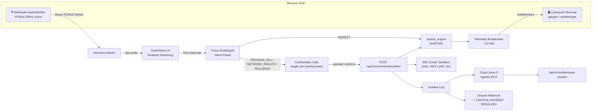

# VoiceOps Controller


**VoiceOps: Autonomous, Sub-second Voice-Driven SRE Incident Mitigation Engine.**

Speak an operations command in English, Arabic, Spanish, French, or Chinese and watch the
cyberpunk-terminal HUD transcribe, parse, and preview it in real time. `PROCESS_KILL`,
`NETWORK_ISOLATE`, and `ROLLBACK` are gated behind single-use, expiring confirmation tokens —
nothing mutates from voice alone. On confirmation, VoiceOps executes the remediation against
real host telemetry or a simulated Kubernetes cluster, generates an agentic SRE post-mortem
via **Groq Llama-3**, and fires a rich **Discord** alert — all within a sub-second loop.

Built for the AssemblyAI real-time hackathon: our competitive edge is a **zero-dependency
native AudioWorklet PCM16 pipeline** (no external CDN libraries) streaming directly into
AssemblyAI's v3 realtime STT, a **deterministic multilingual fuzzy intent parser**, **bounded
backpressure** on every WebSocket, **single-use confirmation tokens**, and **bilingual SRE
support** from day one (English + Arabic).

---

## Contents

- [Architecture](#architecture)
- [Competitive Edge](#competitive-edge)
- [Features](#features)
- [Multilingual Voice Commands](#multilingual-voice-commands)
- [Local Quickstart](#local-quickstart)
- [Docker Quickstart](#docker-quickstart)
- [Testing](#testing)
- [Configuration](#configuration)
- [Safety & Security Model](#safety--security-model)
- [License](#license)

---

## Architecture



## Competitive Edge

- **Zero-Latency Native AudioWorklet:** The browser captures microphone audio at its native
  sample rate, resamples and downsamples to mono 16 kHz signed 16-bit little-endian PCM in a
  `AudioWorkletProcessor`, and streams raw binary frames over a single WebSocket — no external
  CDN dependencies.
- **Bounded Backpressure:** Both the provider queue (`AssemblyAIStreamingSession`) and the
  client audio queue are capped. Slow consumers trigger retryable errors instead of unbounded
  memory growth.
- **Single-Use Confirmation Tokens:** Every mutating command receives a `secrets.token_urlsafe`
  token with a TTL. Only an explicit `POST /api/v1/commands/confirm` with the real token can
  cause mutation; dry-run previews do not consume it.
- **Bilingual SRE Support (EN/AR) and Beyond:** The deterministic parser supports English,
  Arabic, Spanish, French, and Simplified Chinese, including fused pronouns like "اقفله",
  "terminarlo", "arrête-le", and "把它关掉".
- **Agentic Groq Post-Mortem:** When `GROQ_API_KEY` is configured, resolved incidents are
  handed to Llama-3 to produce a full Root Cause Analysis in Markdown; the endpoint falls
  back to a deterministic template if the API is unavailable or unconfigured.
- **Real-Time Discord Alerting:** Successful mitigations dispatch a cyberpunk-styled Discord
  embed with the executed command, mitigated target, and sub-second MTTR.

---

## Features

### Real-Time Voice Pipeline
- Native `AudioWorklet` microphone capture and live PCM16 resampling (16–192 kHz input).
- Canvas oscilloscope waveform, transcript/action feed, and `speechSynthesis` feedback.
- Exponential-backoff WebSocket reconnect with jitter and safe microphone release on stop.

### Safety & Determinism
- Single-use, expiring confirmation tokens for every mutating action.
- Dry-run previews that do not consume the token.
- Protected-process allowlist (OS init, controller process, etc.).
- Same-origin WebSocket protection on `/ws/telemetry` and `/ws/voice-stream`.

### Telemetry & Simulation
- `HOST_LOCAL` mode: live CPU, memory, disk, socket, and process rankings via `psutil`.
- `K8S_CLUSTER` mode: simulated `payment-gateway-pod`, `auth-service-pod`, `redis-sentinel-pod`,
  with live RPS, p99 latency, and 5xx error-rate metrics. `ROLLBACK` and `PROCESS_KILL`
  immediately recover the anomalous pod.

### Enterprise Integrations
- `GET /api/v1/incident/post-mortem` exports JSON or Markdown with `ai_generated` flag.
- Discord webhook embeds on successful `PROCESS_KILL`, `NETWORK_ISOLATE`, and `ROLLBACK`.
- Lean, multi-stage `Dockerfile` and `docker-compose.yml` for production deployment.

---

## Multilingual Voice Commands

| Language | Terminate it | Isolate it | Inspect it | Rollback |
|----------|--------------|------------|------------|----------|
| English  | "kill it" | "isolate it" | "show memory" | "rollback the change" |
| Arabic   | "اقفله" | "اعزل" | "افحص الذاكرة" | "ارجع التعديل" |
| Spanish  | "terminarlo" | "aislar" | "mostrar la memoria" | "revertir el cambio" |
| French   | "arrête-le" | "isoler" | "afficher la mémoire" | "annuler le changement" |
| Chinese  | "把它关掉" | "隔离" | "检查内存" | "回滚" |

A typical conversational flow:

1. "what's using the most memory" — parser stores the top process.
2. "kill it" — pronoun resolves to that process; dry-run preview opens in the HUD.
3. Operator clicks **CONFIRM EXECUTION** — token is consumed and the action executes.

---

## Local Quickstart

```powershell
git clone https://github.com/NemesisDevX/VoiceOps-Controller.git
cd VoiceOps-Controller

python -m venv .venv
.\.venv\Scripts\Activate.ps1
pip install -r requirements.txt

cp .env.example .env
# Edit .env and set ASSEMBLYAI_API_KEY to your real key.
# Optionally set GROQ_API_KEY and DISCORD_WEBHOOK_URL for enterprise features.

uvicorn app.main:app --reload
```

Open **http://localhost:8000** to load the cyberpunk HUD. Microphone capture requires a
secure origin (`localhost` or HTTPS) and a browser with `AudioWorklet` support.

---

## Docker Quickstart

```powershell
cp .env.example .env
# Edit .env and set ASSEMBLYAI_API_KEY (and optional GROQ_API_KEY / DISCORD_WEBHOOK_URL).

docker compose up --build
```

This builds the multi-stage image from the included `Dockerfile` (slim Python 3.12 base,
non-root user, `HEALTHCHECK` against `/health`) and runs the `voiceops` service on
port `8000`.

To build and run without Compose:

```powershell
docker build -t voiceops-controller .
docker run --rm -p 8000:8000 --env-file .env voiceops-controller
```

---

## Testing

Backend (pytest, from the repo root with the virtual environment active):

```powershell
.\.venv\Scripts\python -m pytest tests/ -v
```

Frontend audio DSP and real headless-browser integration suite (Node 22+, server running
on port 8000):

```powershell
node --test tests/test_audio.mjs tests/test_hud_browser.mjs
```

`test_audio.mjs` validates PCM16 framing, little-endian samples, stereo-to-mono mixing,
anti-alias filtering, and resampling continuity. `test_hud_browser.mjs` drives a real
headless Chromium/Edge instance against the live server with mocked mutations and STT.

---

## Configuration

Settings are read from a `.env` file (gitignored; see `.env.example`) via `pydantic-settings`
in `app/core/config.py`:

| Variable | Purpose |
|----------|---------|
| `ASSEMBLYAI_API_KEY` | **Required.** Realtime streaming transcription key. |
| `HOST` / `PORT` | Bind address and port (default `0.0.0.0` / `8000`). |
| `LOG_LEVEL` | Structured JSON log level. |
| `TELEMETRY_INTERVAL_MS` | `/ws/telemetry` broadcast interval (default `1000`). |
| `CONFIRMATION_TOKEN_TTL_SECONDS` | Confirmation token expiry (default `60`). |
| `TOP_PROCESS_LIMIT` | Number of top processes in telemetry snapshots (default `5`). |
| `GROQ_API_KEY` | Optional. Enables Llama-3 agentic post-mortem generation. |
| `GROQ_MODEL` | Optional. Model name, e.g. `llama3-8b-8192` (default). |
| `DISCORD_WEBHOOK_URL` | Optional. Enables real-time resolution alerts. |
| `DISCORD_ALERTS_ENABLED` | Optional. Default `true`; set `false` to disable alerts. |

Never commit `.env` or print real API keys.

---

## Safety & Security Model

- **No voice-only execution.** Mutating intents are always previewed and gated behind an
  explicit operator confirmation.
- **Single-use, expiring tokens.** Tokens are generated with `secrets.token_urlsafe`, stored
  in-memory, and consumed on redemption.
- **Protected-process allowlist.** Core OS and controller processes cannot be terminated or
  network-isolated.
- **Trusted-local-operator model.** This is a single-worker tool for a trusted operator on a
  local machine or private network. It does not implement multi-user auth, OAuth, or per-user
  authorization — do not expose it to untrusted networks or users.
- **Same-origin WebSocket protection** on `/ws/telemetry` and `/ws/voice-stream`.

---

## License

MIT — see [`LICENSE`](./LICENSE).
