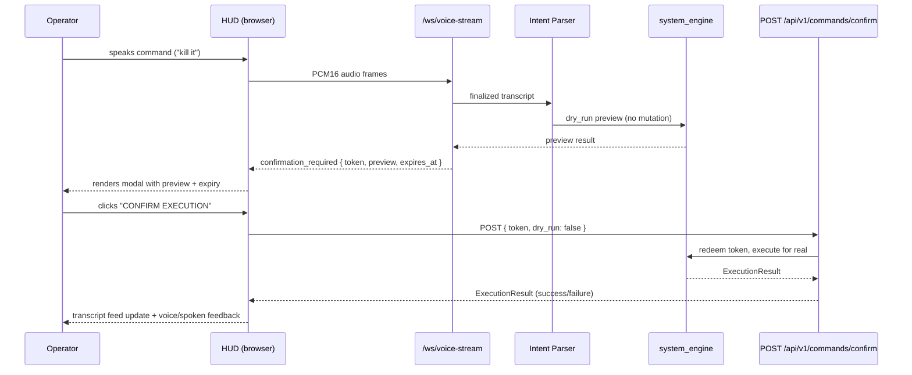

# VoiceOps Controller


**A real-time, voice-driven infrastructure incident-mitigation backend.** Speak an
operations command ("what's using the most memory", "kill it", "isolate that
process from the network"), watch a live cyberpunk-terminal HUD transcribe and
parse it deterministically and multilingually, and — for anything destructive —
explicitly click **CONFIRM EXECUTION** before a single byte of system state
changes. Nothing mutates from voice alone.

VoiceOps Controller is a trusted-local-operator, single-worker tool. It is not a
multi-user or internet-facing service, and it does not implement authentication,
OAuth, or per-user authorization — see [Safety & Security Model](#safety--security-model).

---

## Contents

- [Architecture](#architecture)
- [Confirmation Safety Gate](#confirmation-safety-gate)
- [Features](#features)
- [Local Quickstart](#local-quickstart)
- [Docker Quickstart](#docker-quickstart)
- [Testing](#testing)
- [Multilingual Voice Commands](#multilingual-voice-commands)
- [Configuration](#configuration)
- [Safety & Security Model](#safety--security-model)

---

## Architecture

```mermaid
flowchart LR
    MIC["Browser mic capture\n(AudioWorklet, PCM16 16kHz)"] -->|binary frames| WS["/ws/voice-stream"]
    WS -->|streamed PCM16| AAI["AssemblyAI v3\nrealtime streaming API\n(native websockets client)"]
    AAI -->|partial/final transcript| PARSER["Intent Parser\n(deterministic, multilingual,\ndifflib fuzzy match + pronoun memory)"]
    PARSER -->|INSPECT| ENGINE
    PARSER -->|PROCESS_KILL / NETWORK_ISOLATE| GATE["Confirmation Gate\n(single-use, expiring token)"]
    GATE -->|operator clicks CONFIRM| ENGINE["system_engine\n(psutil host telemetry/actions,\nor simulated K8s pod sandbox)"]
    ENGINE --> TSTREAM["Telemetry Broadcaster\n(~1s tick)"]
    TSTREAM -->|/ws/telemetry| HUD["Static HUD Dashboard\n(Web Components, Canvas oscilloscope,\nspeechSynthesis feedback)"]
    WS -.->|transcript + command_result| HUD
```



## Confirmation Safety Gate

Every mutating action (process kill, network isolation) is parsed and *previewed*
before it can ever execute — the voice pipeline never triggers a mutation by
itself.



The token is single-use and time-limited (`CONFIRMATION_TOKEN_TTL_SECONDS`,
default 60s). A `dry_run: true` request may re-preview the pending command
without consuming it; only `dry_run: false` redeems and executes it.

## Features

**Phase 1 — Core engine**
- FastAPI backend (`app/main.py`) with async lifespan-managed startup/shutdown.
- Non-blocking host telemetry and process introspection via `psutil`
  (`app/services/system_engine.py`): CPU/memory/disk, active sockets, and
  top processes by CPU/memory.
- Protected-process allowlist and a single-use, expiring confirmation-token
  gate for all mutating actions (`app/core/security.py`).
- REST surface: `GET /health`, `GET /api/v1/state`,
  `POST /api/v1/commands/confirm` (supports `dry_run`).
- Automated SRE incident post-mortems (`app/services/incident_log.py`,
  `GET /api/v1/incident/post-mortem`): every gated mutation opens an
  in-memory incident record (triggering alert, audio remediation command,
  actor, confirmation token) and closes it with a Mean Time To Resolution
  (MTTR) once the operator confirms execution. Exportable as JSON or
  Markdown (`?format=markdown`), with an **EXPORT POST-MORTEM** button in
  the HUD terminal panel that downloads the latest resolved incident.

**Phase 2 — HUD + audio pipeline**
- Zero-dependency, native Web Components / vanilla-JS "cyberpunk terminal"
  dashboard (`app/static/`) served at `/` (assets at `/static/`): live
  telemetry gauges, a process table, a terminal-style transcript/action feed,
  and browser `speechSynthesis` voice feedback.
- Web Audio API `AudioWorklet`-based microphone capture and resampler feeding
  a `Canvas` waveform oscilloscope and the voice-stream socket.
- `/ws/voice-stream` (PCM16 ingestion, same-origin protected) and
  `/ws/telemetry` (broadcast-only live telemetry feed), plus
  `app/services/assemblyai_client.py`, which streams audio to AssemblyAI's
  v3 realtime API over a native `websockets` client (no AssemblyAI SDK),
  with keyterm biasing for infra vocabulary (Kubernetes, PID, SIGKILL,
  postgres, nginx, etc.).
- Interactive confirmation modal that requires an explicit button click —
  destructive actions are never auto-executed from voice alone.

**Phase 3 — Multilingual parser + K8s sandbox groundwork**
- Deterministic, multilingual (English, Arabic, Spanish, French, Chinese)
  fuzzy-matching intent parser (`app/services/intent_parser.py`) built on
  stdlib `difflib`, with stateful pronoun resolution (e.g. "kill it",
  "اقفله", "terminarlo", "arrête-le", "把它关掉").
- A simulated Kubernetes cluster sandbox in `system_engine.py` and the
  `TelemetryMode` (`HOST_LOCAL` / `K8S_CLUSTER`) and `ClusterTelemetry` /
  `PodInfo` schemas (`app/schemas/telemetry.py`) modeling three pods
  (`payment-gateway-pod` — seeded with a live high-memory/5xx anomaly —
  `auth-service-pod`, `redis-sentinel-pod`) with RPS, p99 latency, and
  5xx error-rate metrics, plus a `ROLLBACK` intent for cluster-style
  remediation that immediately recovers the anomaly's metrics on
  execution.
- `GET/POST /api/v1/telemetry/mode` to read/switch between `HOST_LOCAL`
  and `K8S_CLUSTER`, and `GET /api/v1/cluster/state` for an on-demand
  cluster snapshot. `/ws/telemetry` broadcasts whichever mode is active
  (flattened `SystemTelemetry` or `ClusterTelemetry` fields, tagged with
  `"mode"`), and the HUD header exposes a live `HOST_LOCAL` / `K8S_CLUSTER`
  toggle that swaps the metric gauges and process table for pod telemetry.
  `POST /api/v1/commands/confirm` routes `PROCESS_KILL` / `NETWORK_ISOLATE`
  / `ROLLBACK` to the cluster simulator instead of real `psutil` actions
  whenever the pending confirmation was opened while in `K8S_CLUSTER` mode.
- AssemblyAI streaming connections are seeded with a `keyterms_prompt`
  of infrastructure vocabulary (Kubernetes, k8s, PID, SIGKILL, postgres,
  nginx, redis, prometheus, rollback, pod, ingress, OOMKilled, etc.) to
  reduce transcription ambiguity on operational terms.

## Local Quickstart

```powershell
git clone <this-repo-url>
cd VoiceOps-Controller

python -m venv .venv
.\.venv\Scripts\Activate.ps1

pip install -r requirements.txt

cp .env.example .env
# then edit .env and set ASSEMBLYAI_API_KEY to your real key

uvicorn app.main:app --reload
```

Open **http://localhost:8000** — the HUD dashboard is served at `/`.
Microphone capture requires `localhost`/HTTPS and `AudioWorklet` support, and
only starts after an explicit operator interaction (e.g. clicking the mic
button).

## Docker Quickstart

```powershell
cp .env.example .env
# edit .env and set your real ASSEMBLYAI_API_KEY (never commit this file)

docker compose up --build
```

This builds the image from the included `Dockerfile` (slim Python 3.12 base,
non-root user, `HEALTHCHECK` against `/health`) and starts the `voiceops`
service defined in `docker-compose.yml`, mapping port `8000:8000` with
`restart: unless-stopped`. Open **http://localhost:8000**.

To build/run without Compose:

```powershell
docker build -t voiceops-controller .
docker run --rm -p 8000:8000 --env-file .env voiceops-controller
```

## Testing

Backend (pytest, from the repo root, with the virtual environment active):

```powershell
.\.venv\Scripts\python -m pytest tests/ -v
```

Frontend audio DSP correctness and a real headless-browser integration suite
(Node's built-in test runner; requires Node 22+ and the server already
running on port 8000):

```powershell
node --test tests/test_audio.mjs tests/test_hud_browser.mjs
```

`test_audio.mjs` checks PCM16 framing, little-endian samples, mixing,
anti-alias filtering, resampling continuity, and reconnect timing.
`test_hud_browser.mjs` drives a real headless-Chromium/Edge instance against
the live server with intercepted voice-provider/confirmation requests. See
`AGENTS.md` for the full set of verification and operating constraints
(e.g. tests must mock mutations and AssemblyAI network calls — never
terminate real processes or install firewall rules during verification).

## Multilingual Voice Commands

The intent parser matches commands deterministically across five languages,
with stateful pronoun resolution so a target only needs to be named once:

| Language | Example ("kill/terminate it") |
| --- | --- |
| English | "kill it" |
| Arabic | "اقفله" |
| Spanish | "terminarlo" |
| French | "arrête-le" |
| Chinese | "把它关掉" |

A typical flow: "what's using the most memory" (INSPECT) → the parser
remembers the top result → "kill it" resolves the pronoun to that process and
raises a `PROCESS_KILL` intent, which is previewed and gated behind the
confirmation modal — never executed directly from speech.

## Configuration

Settings are read from a `.env` file (gitignored; see `.env.example`) via
`pydantic-settings` (`app/core/config.py`):

| Variable | Purpose |
| --- | --- |
| `ASSEMBLYAI_API_KEY` | Required. Your AssemblyAI API key for realtime streaming transcription. |
| `HOST` / `PORT` | Bind address for uvicorn (defaults `0.0.0.0` / `8000`). |
| `LOG_LEVEL` | Structured JSON log level. |
| `TELEMETRY_INTERVAL_MS` | Broadcast interval for `/ws/telemetry` (default `1000`). |
| `CONFIRMATION_TOKEN_TTL_SECONDS` | Expiry window for confirmation tokens (default `60`). |
| `TOP_PROCESS_LIMIT` | Number of top processes returned in telemetry/state snapshots (default `5`). |

Never commit `.env` or print/log real API keys — see `AGENTS.md`.

## Safety & Security Model

- **No voice-only execution.** `PROCESS_KILL` and `NETWORK_ISOLATE` (and
  `ROLLBACK`) are always previewed as a dry run and require the operator to
  click an explicit confirmation button in the HUD before
  `POST /api/v1/commands/confirm` executes them for real.
- **Single-use, expiring confirmation tokens.** Tokens are generated with
  `secrets.token_urlsafe`, stored in-memory, and are consumed on redemption
  or pruned on expiry (`app/core/security.py`).
- **Protected-process allowlist.** Core OS/session processes and the
  controller's own interpreter/server process can never be killed or
  network-isolated, regardless of what is requested.
- **Trusted-local-operator model.** This is a single-worker service meant to
  be run by one trusted operator on a local machine or private network. It
  does **not** implement multi-user accounts, OAuth, or per-user
  authorization — do not expose it directly to untrusted networks or users.
- **Same-origin WebSocket protection** on `/ws/telemetry` and
  `/ws/voice-stream` to reduce cross-site abuse of the live sockets.

For the full set of verification/operating constraints (e.g. tests must never
terminate real processes or install real firewall rules, provider transport
logs must never expose auth headers or transcript payloads), see `AGENTS.md`.

## License

MIT — see [`LICENSE`](./LICENSE).
